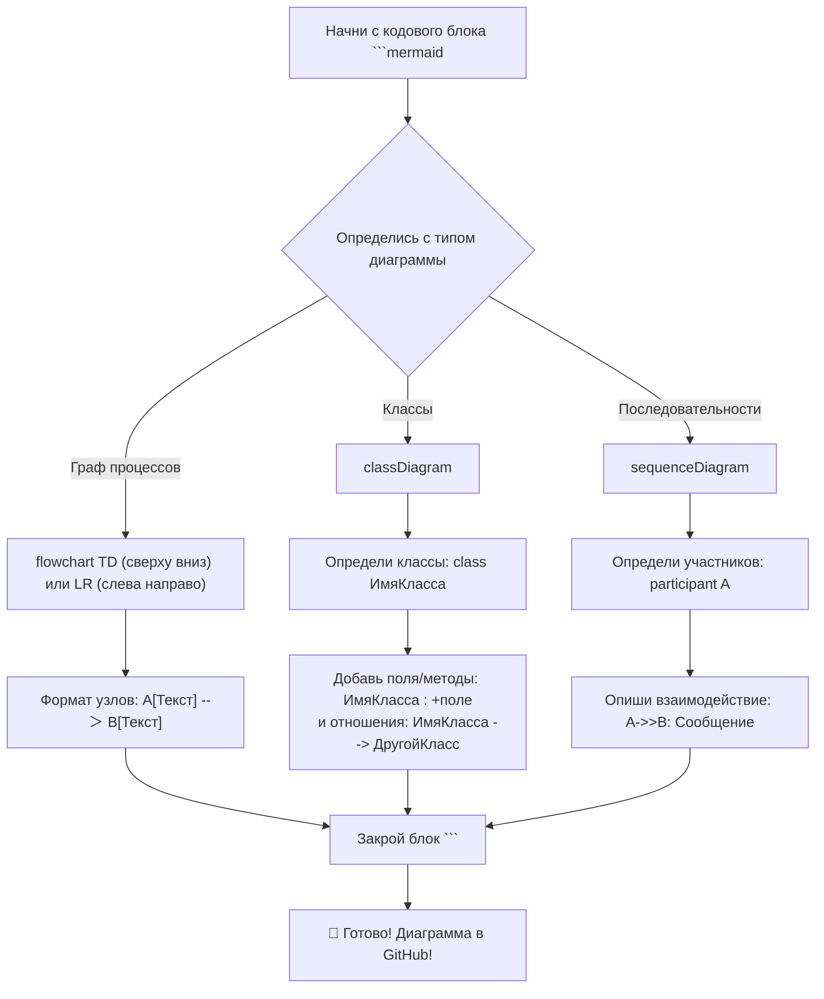

# 🐾 Как оформить README, если у тебя лапки

Не волнуйся, если в голове у тебя smooth brain и ты ничего не знаешь о разметке текста. С этой шпаргалкой ты сможешь оформить свой README красивее и повыделываться перед коллегами. 

> "Лучше клоунский README, чем вообще никакого"    
> *-Твоя мама*

## 🔥 Шпаргалка

# Вот большие буквы
## Вот буквы поменьше 
Вот **толстые** и *кривые*.

### 🐱 Как кот выделяет код
```python
def purr():
    return "Мрррр-мяу!"
```

### 🎨 Как кот выделяет изменения в коде
```diff
+ Хорошая подсветка (добавили код)
- Хорошая подсветка (убрали код)
! Важные комментарии
```


### 🎨 Как кот оформляет табличку
| Команда        | Действие               | Сложность |
|----------------|------------------------|-----------|
| `git push`     | Отправить изменения    | ★☆☆☆☆     |
| `git pull`     | Получить изменения     | ★★☆☆☆     |
| `git purr`     | Волшебство             | ★★★★★     |

### 🧶 Как кот делает гиперссылку
[Скачай вирус!](https://static.wikia.nocookie.net/0e0058fb-654e-403f-8d3b-0b0ea3cbb67e)


### 🌈 Как кот даёт советы 
> [!TIP]  
> Я люблю давать советы!

> [!NOTE]  
> Хорошо выглядишь UwU
  
> [!IMPORTANT]  
> Эти фичи работают только в GitHub.

> [!WARNING]  
> **ВОНЯЕШ!**


## 🐠 При чём тут русалки?
Mermaid.js - модуль для создания диаграмм. Простой, подходит для smooth brains, хорошо встроен в GitHub, можно выпендриваться. Вот как выглядит процесс работы:


> [!TIP]  
> С готовыми примерами можно поиграть [в песочнице](https://mermaid.live/)


## 💖 А что ещё?

### Много чего! Например, вот твой прогресс:
```markdown
Вёрстка:                ██████░░░░ 60%  
Дизайн:                 █████░░░░░ 50%  
Data Engineering:       ████░░░░░░ 30%  
```

Остальное узнаешь с опытом. А сегодняшнее задание ты выполнила на 5+.
